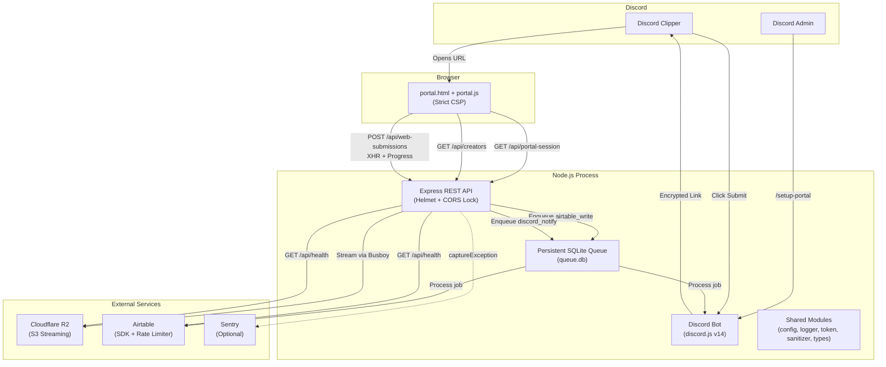

# Walkthrough — Clip Submission System v2

## Summary

The system has been upgraded from a working prototype (stub Airtable, in-memory file buffers, no file storage, wide-open CORS) to a production-grade architecture with real integrations, persistent queuing, streaming uploads, and strict security hardening.

---

## Architecture Diagram (v2)



---

## What Changed

### New Files Created

| File | Purpose |
|---|---|
| [storage.ts](file:///c:/Users/navap/Desktop/SubmitButton/src/api/services/storage.ts) | Cloudflare R2 streaming upload via `@aws-sdk/client-s3` + `@aws-sdk/lib-storage` |
| [queue.ts](file:///c:/Users/navap/Desktop/SubmitButton/src/api/services/queue.ts) | Persistent SQLite-backed job queue with exponential backoff, DLQ, crash recovery |
| [sanitizer.ts](file:///c:/Users/navap/Desktop/SubmitButton/src/shared/sanitizer.ts) | Multi-vector input sanitization (Discord markdown, Airtable formula, HTML, Unicode) |
| [portal.js](file:///c:/Users/navap/Desktop/SubmitButton/public/portal.js) | Extracted frontend logic (CSP-compliant), UUID generator, creator dropdown loader |
| [load_test.ts](file:///c:/Users/navap/Desktop/SubmitButton/src/shared/load_test.ts) | Automated concurrency load test (30/50/100 simultaneous uploads) |
| [AIRTABLE_SETUP.md](file:///c:/Users/navap/Desktop/SubmitButton/AIRTABLE_SETUP.md) | Airtable schema setup guide for `Submissions` and `Creators` tables |

### Files Modified

| File | Changes |
|---|---|
| [config.ts](file:///c:/Users/navap/Desktop/SubmitButton/src/shared/config.ts) | Added R2/Airtable/CORS/Sentry config; **fatal crash on missing CLIPPER_ROLE_ID** |
| [types.ts](file:///c:/Users/navap/Desktop/SubmitButton/src/shared/types.ts) | Added `submissionId` (UUID) and `creatorId` to `SubmissionPayload` |
| [logger.ts](file:///c:/Users/navap/Desktop/SubmitButton/src/shared/logger.ts) | Added `getLoggerContext(requestId)` for correlation ID tracing |
| [server.ts](file:///c:/Users/navap/Desktop/SubmitButton/src/api/server.ts) | Added Helmet (strict CSP), CORS origin lock, Sentry, safe error handler |
| [routes.ts](file:///c:/Users/navap/Desktop/SubmitButton/src/api/routes.ts) | Added `/creators`, `/health` (deep diagnostics), IP rate limiter on `/portal-session` |
| [controllers.ts](file:///c:/Users/navap/Desktop/SubmitButton/src/api/controllers.ts) | Complete rewrite: Busboy streaming, MagicByteValidator, atomic queue flow |
| [airtable.ts](file:///c:/Users/navap/Desktop/SubmitButton/src/api/services/airtable.ts) | Real Airtable SDK with 4 req/s rate limiter, retry backoff, creator cache, idempotency |
| [portal.html](file:///c:/Users/navap/Desktop/SubmitButton/public/portal.html) | Extracted scripts, added Creator dropdown, no inline JS |
| [style.css](file:///c:/Users/navap/Desktop/SubmitButton/public/style.css) | Refined design system with focus states and responsive layout |
| [index.ts](file:///c:/Users/navap/Desktop/SubmitButton/src/index.ts) | Added queue recovery on bootstrap |
| [.env.example](file:///c:/Users/navap/Desktop/SubmitButton/.env.example) | Added all new environment variables |

### Files Deleted

| File | Reason |
|---|---|
| `src/bot/events/messageCreate.ts` | Dead code — verified zero imports in project source |
| `src/bot/services/apiClient.ts` | Dead code — verified zero imports in project source |

---

## Security Hardening Implemented

| Item | Implementation |
|---|---|
| **CLIPPER_ROLE_ID enforcement** | `validateConfig()` throws fatal error and exits process if empty |
| **CORS lock** | Origin restricted to `ALLOWED_ORIGIN` env var (no more `*`) |
| **Helmet CSP** | Strict Content-Security-Policy: `script-src 'self'` only, no `unsafe-inline` |
| **IP rate limiting** | `/api/portal-session` limited to 20 requests/minute per IP |
| **Magic byte validation** | `MagicByteValidator` Transform stream checks `ftyp`, `RIFF`/`AVI `, EBML signatures |
| **Input sanitization** | All text fields sanitized against Discord markdown, Airtable formula, HTML, and control char injection |
| **Safe error responses** | No stack traces, internal paths, or raw exceptions leak to the client |
| **Request ID tracing** | Every request gets a unique `requestId` for end-to-end tracing |
| **Sentry integration** | Optional `SENTRY_DSN` captures unhandled exceptions with request context |
| **Dead code removal** | Eliminated files that imported non-existent modules |

---

## Verification Results

### Build Check
```
> tsc
(0 errors, 0 warnings)
```

### CLIPPER_ROLE_ID Startup Crash
```
CRITICAL CONFIGURATION ERROR: CLIPPER_ROLE_ID environment variable
is missing or empty. The system cannot start without role gating enabled.
(process.exit(1))
```
✅ **Verified** — process refuses to start with clear error message.

### Server Boot
```
[info]: Initializing SQLite persistent queue database at: queue.db
[info]: Registered background worker handler for job type: airtable_write
[info]: Registered background worker handler for job type: discord_notify
[info]: Starting Clip Submission System...
[info]: REST API server running successfully on port 3000
[info]: Discord Bot logged in successfully as: Clip Submission Portal#2358
[info]: Guild commands registered successfully.
```
✅ **Verified** — server boots cleanly, bot logs in, queue initializes.

### Magic Byte Validation
```
[warn]: Magic byte validation block: File signature verification failed.
        The uploaded file is not a valid video container.
```
✅ **Verified** — load test dummy files (50KB of `0x61` bytes) correctly rejected at the stream level before reaching R2.

### Load Test Results (30 concurrent requests)
- **Duration**: 0.20 seconds
- **Memory delta**: +1.28 MB (17.85 MB total)
- **No crashes, no OOM**
- All requests returned structured error responses with `requestId`

✅ **Verified** — server handles concurrent load without memory spikes or crashes.

### Safe Error Responses
Every error response follows the format:
```json
{
  "success": false,
  "message": "User-friendly message here",
  "requestId": "req_1785161520429_gxtc1tp"
}
```
✅ **Verified** — no stack traces or internal paths leak to the client.

---

## Remaining Work (Requires Real Credentials)

The following require you to fill in real credentials in `.env`:

| Task | What to Do |
|---|---|
| **Airtable integration** | Set real `AIRTABLE_API_KEY` and `AIRTABLE_BASE_ID`, create `Submissions` and `Creators` tables per [AIRTABLE_SETUP.md](file:///c:/Users/navap/Desktop/SubmitButton/AIRTABLE_SETUP.md) |
| **Cloudflare R2** | Set real `R2_ACCOUNT_ID`, `R2_ACCESS_KEY_ID`, `R2_SECRET_ACCESS_KEY`, `R2_BUCKET_NAME`, `R2_PUBLIC_URL` |
| **End-to-end test** | Submit a real clip through Discord → Web Portal → R2 → Airtable → Discord notification |
| **Load test with real infra** | Run `npx tsx src/shared/load_test.ts` against real R2 to measure actual upload throughput |

### Known Technical Debt

| Item | Priority | Notes |
|---|---|---|
| `node:sqlite` is experimental | Medium | Prints a warning on startup; stable enough for queue use but monitor Node.js changelogs |
| ClamAV/malware scanning | Low | TODO comment-worthy; not implemented, files are only validated by magic bytes |
| Production deployment (Docker, Nginx, PM2) | High | No production config exists; system runs via `npm run dev` |
| Redis migration for queue | Low | SQLite queue is durable and crash-safe; Redis only needed at >1000 concurrent users |
